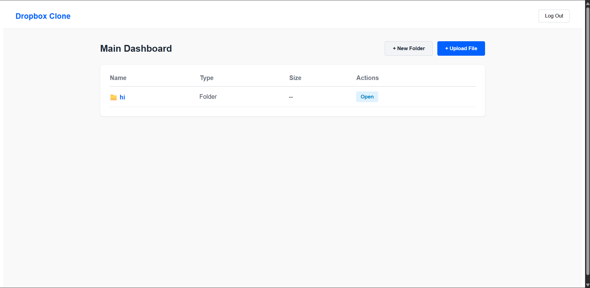
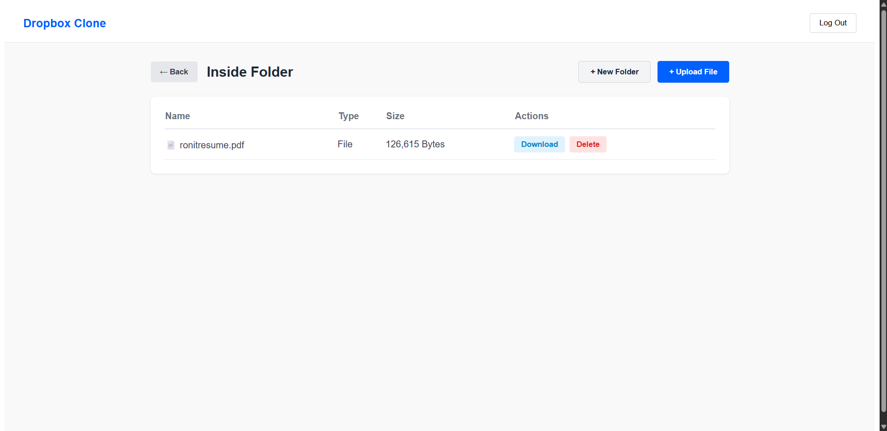
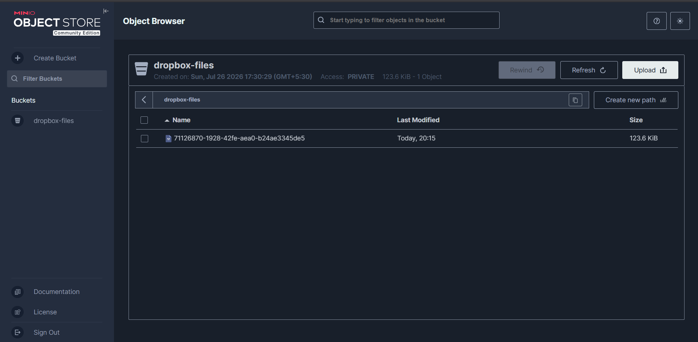

# ☁️ Dropbox Clone

> A full-stack, cloud-native file storage application inspired by Dropbox, built with React, Flask, PostgreSQL, MinIO, and Docker.


---

## 📖 Overview

Dropbox Clone is a **cloud-native file management application** that recreates the core functionality of modern cloud storage platforms like Dropbox.

The application allows users to create accounts, organize files within an **infinite nested folder hierarchy**, securely upload and download files, and store physical objects separately from metadata using an enterprise-style architecture.

Rather than storing uploaded files directly in the backend, the application follows a **decoupled storage architecture**:

- **PostgreSQL** stores metadata (users, folders, file information)
- **MinIO (S3-compatible object storage)** stores physical files
- **Flask API** manages authentication and metadata
- **React** provides a responsive user interface

This architecture closely resembles how production cloud storage platforms are designed.

---

# ✨ Features

### 🔐 Secure Authentication

- JWT-based stateless authentication
- Secure password hashing with bcrypt
- Protected API routes
- User-specific file access

---

### 📁 Infinite Folder Hierarchy

Organize files exactly like a desktop file explorer.

Features include:

- Create folders
- Delete folders
- Navigate between folders
- Unlimited nested folders
- Self-referential PostgreSQL relationships

---

### 📄 File Operations

Users can:

- Upload files
- Download files
- Delete files
- Store metadata separately from physical file data

---

### 🛡️ Zero-Trust File Downloads

Instead of downloading files through the backend server:

1. Backend authenticates the user.
2. Backend generates a **temporary MinIO Presigned URL**.
3. Frontend downloads the file directly from object storage.

Benefits:

- Better scalability
- Reduced backend load
- Secure temporary access
- Industry-standard architecture

---

# 🏗️ System Architecture

```
                 React Frontend
                        │
                        │ REST API
                        ▼
                 Flask Backend API
                        │
         ┌──────────────┴──────────────┐
         ▼                             ▼
 PostgreSQL                     MinIO Object Storage
(File Metadata)                 (Physical Files)
```

---

# ⚙️ Tech Stack

| Layer | Technology |
|--------|------------|
| Frontend | React + Vite |
| HTTP Client | Axios |
| Backend | Python + Flask |
| ORM | SQLAlchemy |
| Authentication | JWT |
| Database | PostgreSQL |
| Object Storage | MinIO (AWS S3 Compatible) |
| Containerization | Docker & Docker Compose |

---

# 📷 Screenshots

## 🏠 Main Dashboard



---

## 📂 Folder Navigation



---

## 🗄️ MinIO Object Storage



---

# 🚀 Getting Started

## Prerequisites

Make sure the following software is installed:

- Docker Desktop
- Python 3.x
- Node.js
- npm

---

# 🐳 Step 1 — Start Infrastructure

Start PostgreSQL and MinIO using Docker Compose.

```bash
docker compose up -d
```

This starts:

- PostgreSQL
- MinIO Object Storage

---

# 🪣 Step 2 — Configure MinIO

Open:

```
http://localhost:9001
```

Login using:

```
Username:
minioadmin

Password:
minioadmin123
```

After logging in:

- Create a new bucket named

```
dropbox-files
```

This bucket will store all uploaded files.

---

# 🐍 Step 3 — Start the Flask Backend

Navigate to the backend directory:

```bash
cd backend
```

Create a virtual environment:

```bash
python -m venv venv
```

Activate the virtual environment.

### Windows

```bash
venv\Scripts\activate
```

### Linux / macOS

```bash
source venv/bin/activate
```

Install dependencies:

```bash
pip install -r requirements.txt
```

Run the backend:

```bash
python run.py
```

---

# ⚛️ Step 4 — Start the React Frontend

Open another terminal.

Navigate to the frontend:

```bash
cd frontend
```

Install dependencies:

```bash
npm install
```

Start the development server:

```bash
npm run dev
```

The frontend will be available at:

```
http://localhost:5173
```

---

# 📂 Project Structure

```
Dropbox-Clone/
│
├── backend/
│   ├── app/
│   ├── models/
│   ├── routes/
│   ├── services/
│   ├── requirements.txt
│   └── run.py
│
├── frontend/
│   ├── src/
│   ├── public/
│   ├── package.json
│   └── vite.config.js
│
├── images/
│   ├── 01.png
│   ├── 02.png
│   └── 03.png
│
├── docker-compose.yml
└── README.md
```

---

# 🔒 Security Highlights

- JWT stateless authentication
- Password hashing with bcrypt
- User-specific authorization
- Presigned URL downloads
- Backend never exposes object storage credentials
- Secure separation of metadata and file storage

---

# 💡 Design Principles

This project follows modern cloud application practices:

- Separation of metadata and object storage
- Stateless backend architecture
- Self-referential relational database design
- Containerized development environment
- AWS S3-compatible storage abstraction
- Secure direct object downloads using presigned URLs

---

# 🎯 Future Improvements

- File sharing via public links
- Drag-and-drop uploads
- File previews
- Folder sharing
- Search functionality
- Version history
- Multi-file uploads
- User storage quotas
- Responsive mobile interface
- Deployment on AWS

---

# 🤝 Contributing

Contributions are welcome!

If you'd like to improve this project:

1. Fork the repository
2. Create a feature branch

```bash
git checkout -b feature/amazing-feature
```

3. Commit your changes

```bash
git commit -m "Add amazing feature"
```

4. Push your branch

```bash
git push origin feature/amazing-feature
```

5. Open a Pull Request

---

# ⭐ Support

If you found this project helpful:

- ⭐ Star the repository
- 🍴 Fork it
- 🛠️ Contribute
- 🐞 Report issues

---

# 📜 License

This project is licensed under the MIT License.

---

## 👨‍💻 Author

**Ronit Mishra**

Cloud Computing Enthusiast • Full-Stack Developer • DevOps Learner

If you enjoyed this project, consider giving it a ⭐ on GitHub!